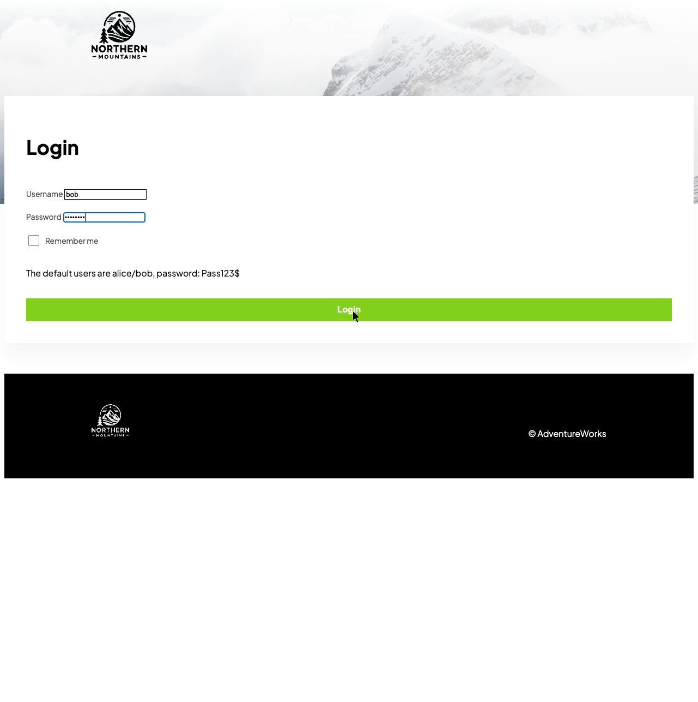
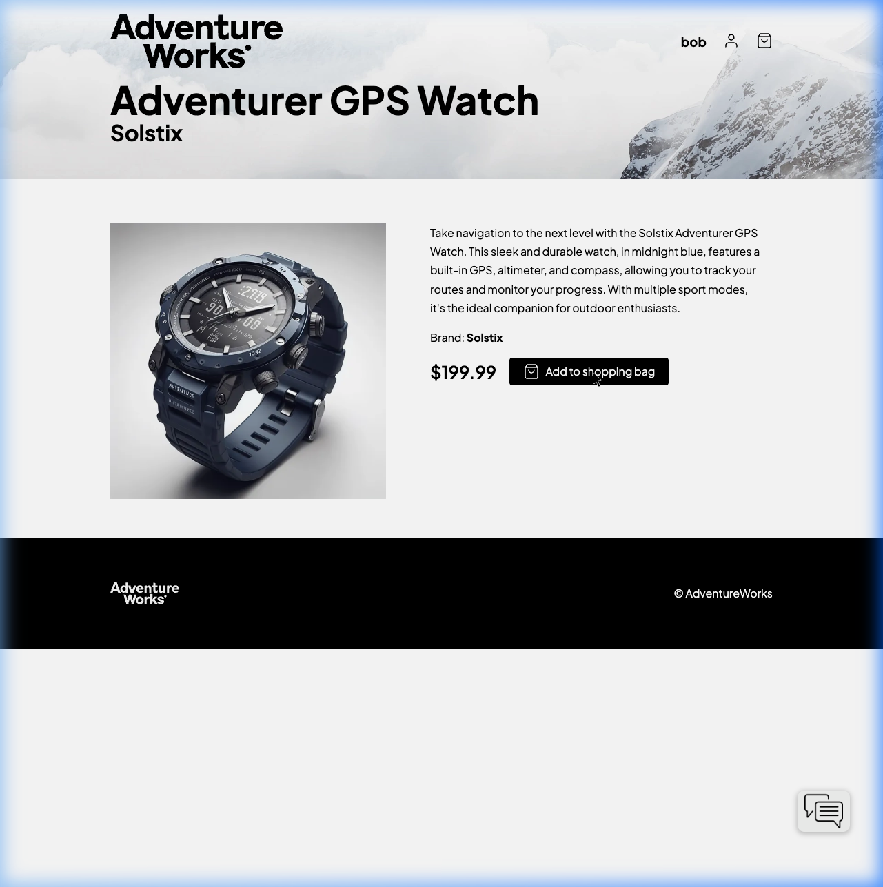
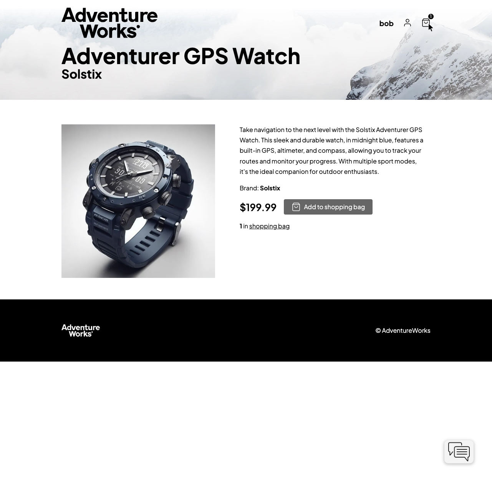
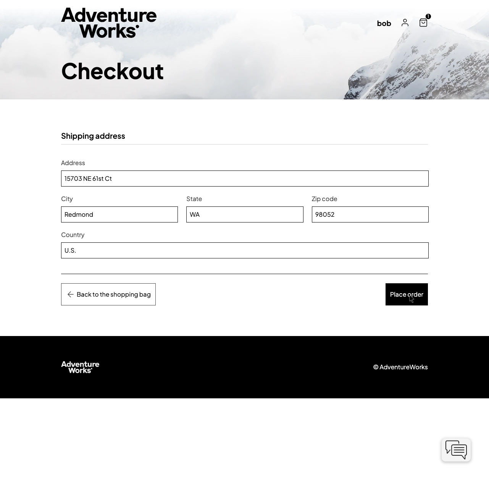

# eShop on OpenShift - End-to-End Test Results

This document contains the visual evidence of the successful deployment and functional verification of the eShop application on OpenShift (CRC).

## 📊 Test Overview
- **Test Date:** 2026-05-03
- **Environment:** OpenShift Local (CRC)
- **Namespace:** `eshop`
- **User:** `bob` (Demo User)
- **Status:** ✅ PASSED

## 📹 Full Test Recording
Below is the recording of the entire test flow:

## 📸 Step-by-Step Verification

### 1. Authentication & Catalog
- **Action:** Accessed the WebApp and navigated to the Identity API for login.
- **Result:** Successful redirect and login as 'bob'.

### 2. Shopping Experience
- **Action:** Selected the 'Adventurer' product and added it to the basket.
- **Result:** Item successfully added (WebApp -> Basket.API -> Redis).

### 3. Basket Management
- **Action:** Navigated to the shopping basket.
- **Result:** Correct items and totals displayed.

### 4. Checkout and Order Completion
- **Action:** Proceeded to checkout and placed the order.
- **Result:** Order successfully submitted (WebApp -> Ordering.API -> RabbitMQ -> Processors).

## 🛠️ Technical Verification
The following backend processes were also verified via logs during this test:
- **Identity.API:** Successfully issued OIDC tokens.
- **Catalog.API:** Served product data and images.
- **Ordering.API:** Created order in Postgres.
- **OrderProcessor:** Received message from RabbitMQ and simulated fulfillment.
- **PaymentProcessor:** Simulated successful payment processing.

---
**Verified by Antigravity AI**
